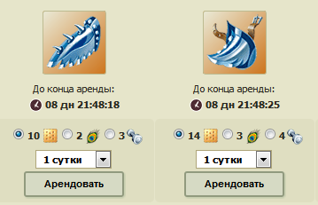
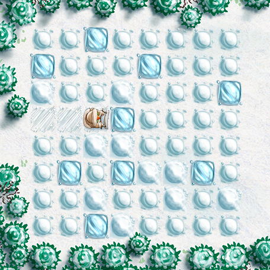

# pernatsk_ruby
*equip.rb*

расчет оптимальной траты ресурсов (печенья-перьев-гантелей) для аренды максимума экипировки в лабиринте

Перед запуском заменить в начале файла количество печенья, перьев, гантелей, которые планируется потратить.

В результатах будет: общее количество дней, на сколько можно закупить эквип, количество железных крыльев за печенье/перья/гантели, аналогично для стальных напопников, и ресы, которые останутся после покупки

===================
*snegokos.rb*

поиск наилучших маршрутов для сбора максимума ресурсов в зимнюю акцию

Перед запуском заменить в начале файла массив с картой на свой (человеческий фактор, да, никаких автоматических парсеров, не умеющих опечатываться).

В результате набор маршутов: (количество добытых медальонов)-(количество пройденных сугробов)-(маршрут по компасу)

например: 35-33-EWNESENWSE
